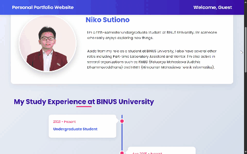
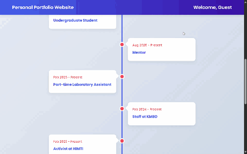
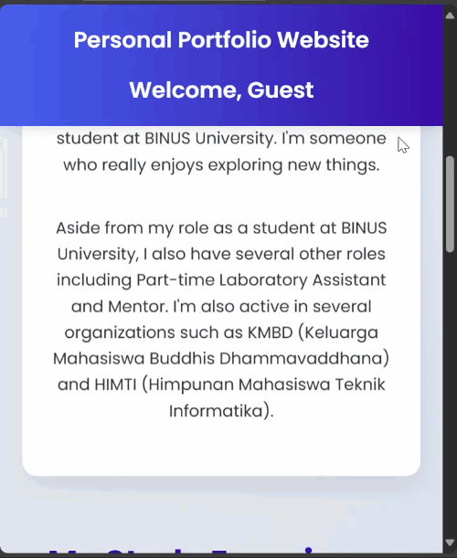

# Personal Portfolio Website

This project is a **Personal Portfolio Website** built using **Laravel** that showcases my personal information and study/work experience at BINUS University.  

## ✨ Key Features

* **About Me Section:** Provides a general introduction and my current roles and affiliations.
* **Timeline of Experience:** A dedicated section detailing my various roles and experiences at BINUS University, including duration.
* **Specific Timeline Pages:** Each timeline item links to a dedicated page providing more in-depth information and a related image.
* **Contact Information:** Easy-to-access contact details.
* **Responsive Design:** Optimized for both desktop and mobile viewing.

---

## 📸 Website Preview

### About Page (Desktop View)

This is the main landing page, `about.html`, which serves as the central hub for my profile and timeline.



### Specific Timeline Page

This is a preview of one of the dynamic specific timeline pages, such as the one for 'Part-time Laboratory Assistant'.



### Mobile View

A look at how the website adapts for smaller screens (smartphone view).



---

## 🛠️ Technology Stack

* **Framework:** Laravel
* **Frontend:** HTML5, CSS3
* **Styling Libraries:** Font Awesome, Google Fonts (Poppins)

---

## 🚀 Getting Started

Follow these steps to set up and run the project locally.

### Prerequisites

You need to have the following installed on your system:

* **PHP** (version compatible with your Laravel setup)
* **Composer**
* **Node.js & npm** (optional, depending on your Laravel version and asset compilation needs)

### Installation

1.  **Clone the repository:**
    ```bash
    git clone https://github.com/NS2006/personal-portfolio
    cd personal-portfolio
    ```

2.  **Install PHP dependencies:**
    ```bash
    composer install
    ```

3.  **Set up the environment file:**
    Copy the example environment file and generate an application key.
    ```bash
    cp .env.example .env
    php artisan key:generate
    ```
    *(Note: This portfolio is primarily static HTML/CSS with some Laravel blade templating, so database configuration in `.env` might not be strictly necessary.)*

4.  **Install Node dependencies and compile assets (if needed):**
    If your project uses compiled CSS/JS assets, run:
    ```bash
    npm install
    npm run dev  # or npm run build
    ```

### Running the Application

To view the website, use the Laravel development server:

```bash
php artisan serve
```
The application will typically be accessible at http://127.0.0.1:8000.
